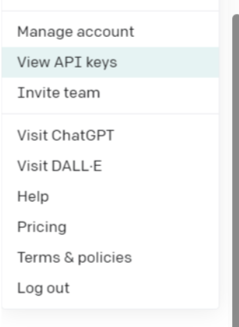
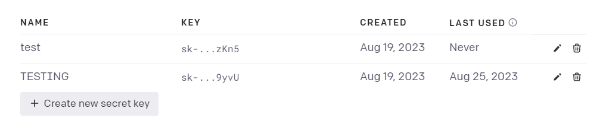
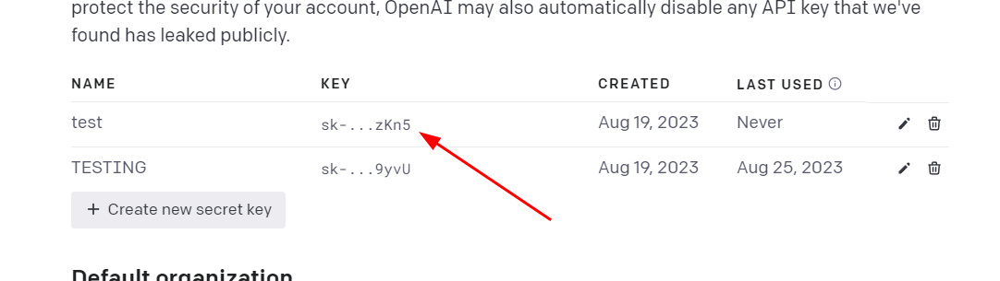
```
from secret_key import openapi_key,serapi_key
import os
os.environ['OPENAI_API_KEY'] = openapi_key
os.environ['SERAPI_API_KEY'] = serapi_key
```

```
from langchain.llms import OpenAI

llm = OpenAI(temperature=0.9)
name = llm.predict("I want to open a restaurant for Indian food. Suggest a fency name for this.")
print(name)
```

```
nepali_name = llm("I want to open a restaurant for Nepali food. Suggest a fency name for this.")
print(nepali_name)
```
We can see that the query gets repeatative and is a bad way of writing a code so we use the prompt template
```
from langchain.prompts import PromptTemplate
prompt_template_name = PromptTemplate(
    input_variables=['country'],
    template = "Suggest some {country} cuisine"
)
p = prompt_template_name.format(country='Hyderabadi')
print(p)
```
p looks like `Suggest some Hyderabadi cuisine`
`print(llm.predict(p))`
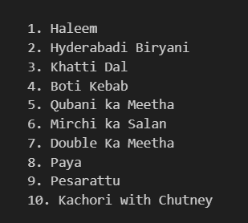
# Chains

```
chain = LLMChain (llm=llm, prompt = prompt_template_name,verbose =True)
print(chain.run("Korean"))
```
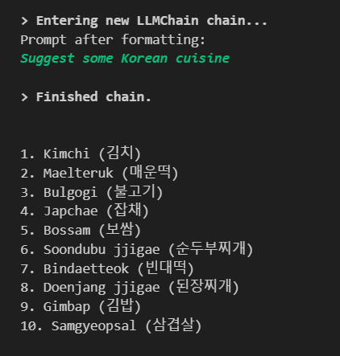
Cuisine -> Resturant Name
```
llm = OpenAI(temperature=0.6)

prompt_template_name = PromptTemplate(
    input_variables =['cuisine'],
    template = "I want to open a restaurant for {cuisine} food. Suggest a fency name for this."
)

name_chain =LLMChain(llm=llm, prompt=prompt_template_name)

prompt_template_items = PromptTemplate(
    input_variables = ['restaurant_name'],
    template="""Suggest some menu items for {restaurant_name}"""
)

food_items_chain = LLMChain(llm=llm, prompt=prompt_template_items)

```
## Simple Sequential Chain
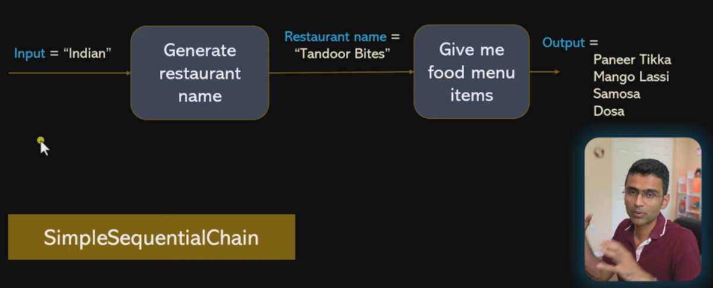
where the rest
```
llm = OpenAI(temperature=0.6)

prompt_template_name = PromptTemplate(
    input_variables =['cuisine'],
    template = "I want to open a restaurant for {cuisine} food. Suggest a fency name for this."
)

name_chain =LLMChain(llm=llm, prompt=prompt_template_name)

prompt_template_items = PromptTemplate(
    input_variables = ['restaurant_name'],
    template="""Suggest some menu items for {restaurant_name}"""
)

food_items_chain = LLMChain(llm=llm, prompt=prompt_template_items)

from langchain.chains import SimpleSequentialChain
chain = SimpleSequentialChain(chains = [name_chain, food_items_chain])

content = chain.run("Hyderabadi")
print(content)
```
The  problems with the simple sequential chain are:
- the name of the suggested resturant wont come 
- The sequence matters in `chain = SimpleSequentialChain(chains = [name_chain, food_items_chain])`
- 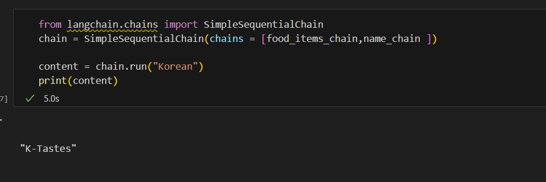
- 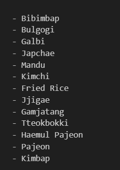
> thats why we use the sequential chain

## Sequential Chain
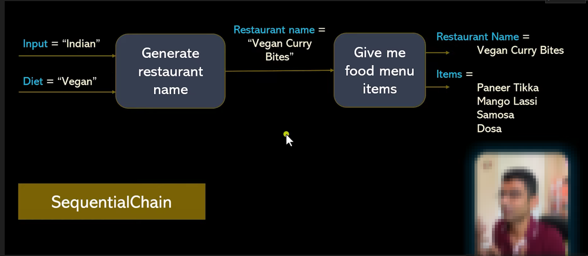
Sequential Chain can produce multiple outputs
```
llm = OpenAI(temperature=0.7)
prompt_template_name = PromptTemplate(
    input_variables =['cuisine'],
    template = "I want to open a restaurant for {cuisine} food. Suggest a fency name for this."
)

name_chain =LLMChain(llm=llm, prompt=prompt_template_name, output_key="restaurant_name")

prompt_template_items = PromptTemplate(
    input_variables = ['restaurant_name'],
    template="Suggest some menu items for {restaurant_name}."
)

food_items_chain =LLMChain(llm=llm, prompt=prompt_template_items, output_key="menu_items")

from langchain.chains import SequentialChain

chain = SequentialChain(
    chains = [name_chain, food_items_chain],
    input_variables = ['cuisine'],
    output_variables = ['restaurant_name', "menu_items"]
)
```
`chain({"cuisine": "Indian"})`
displays the Indian restaurant name and the menus of it in a dictionary form
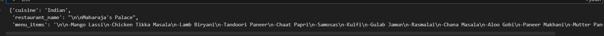
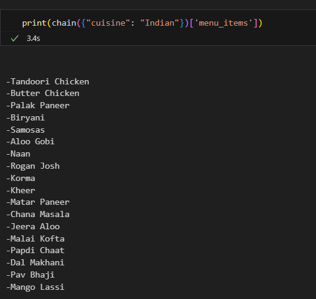

# Agents
Agent is a poweful concept of the lanchain which gives the reasonable capacity to the OpenAi
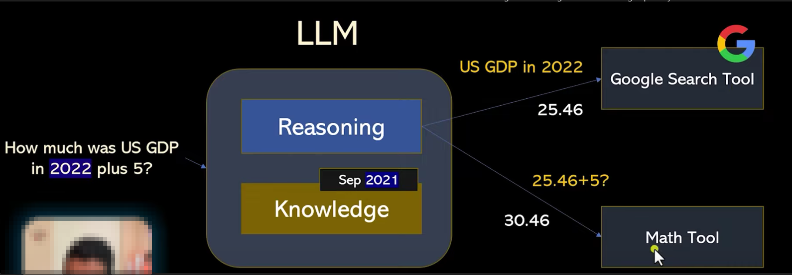

| Month | Savings |
| -------- | ------- |
|  | 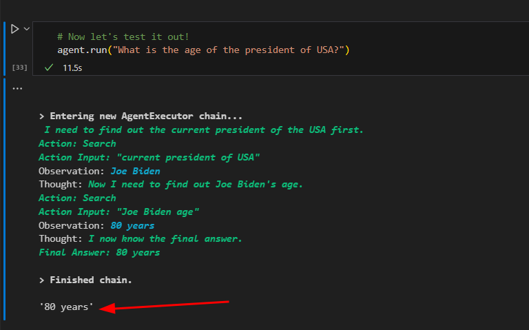 |
|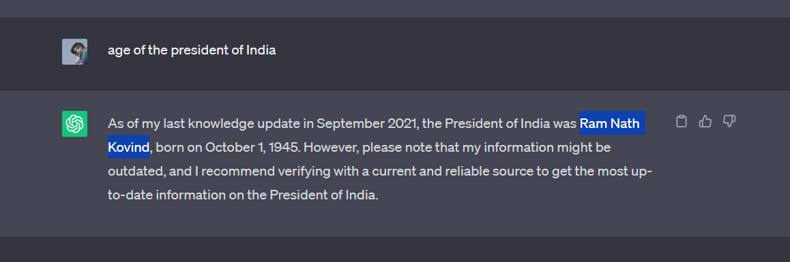|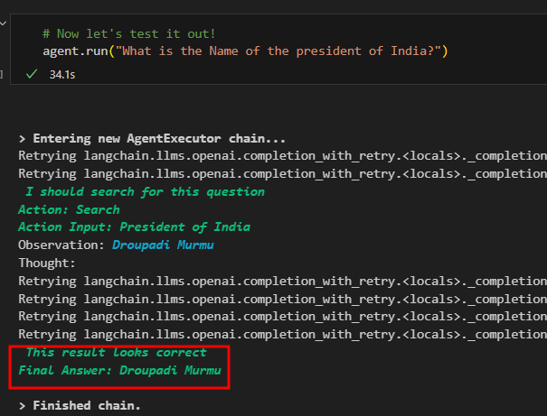|